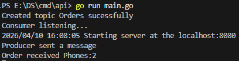
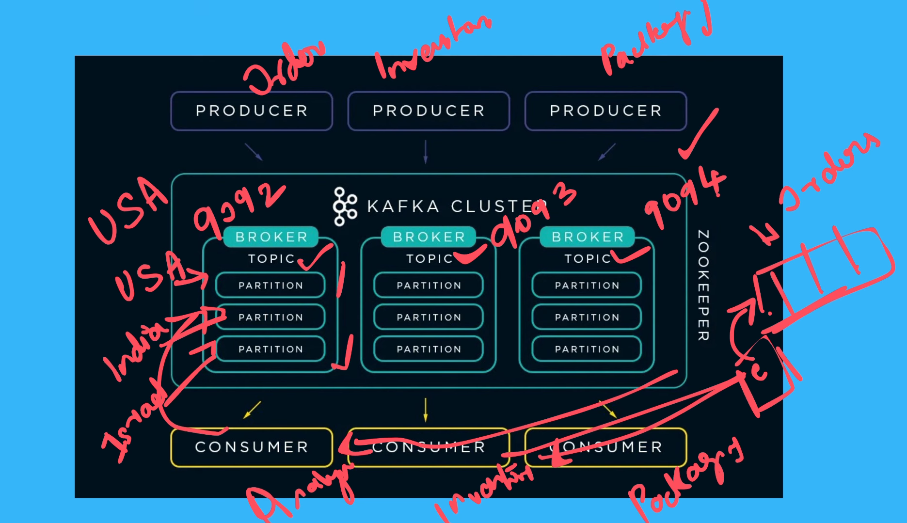

Producer

Broker -> Kafka

Consumer

Producers and consumers both are go routines toh dono ko hee close b kara h humny aur ctx b use kara h for stoping long running go routines
Producers can be ordering,packagin,inventory servers any servers


leader broker can create topics only. we are producers frontend waly.


Any identifier (function, variable, type, constant, struct field) that starts with a lowercase letter is package-private — only accessible inside the same package.
Any identifier that starts with an uppercase letter is exported, meaning other packages can see and use it

```
go get github.com/segmentio/kafka-go
docker-compose up -d (first time)
second time : docker-compose up 
cd cmd\api go run main.go 
```
Starting with Apache Kafka 2.8+, Kafka introduced KRaft mode (Kafka Raft Metadata mode), which removes the need for Zookeeper entirely.

Go web server::8080

Jab tum local Go app se Kafka broker connect karte ho tb localhost:29092 use karte ho

9092 = internal Docker network port
```
[ ZOOKEEPER ]
     ↑
   2181
     ↓
[ KAFKA BROKER ]
   ↑        ↑
9092     29092
(internal) (your Go app)
```
2181 → Kafka ↔ Zookeeper 🐘

9092 → Kafka internal Docker world 🔥

29092 → Your laptop ↔ Kafka 💻



